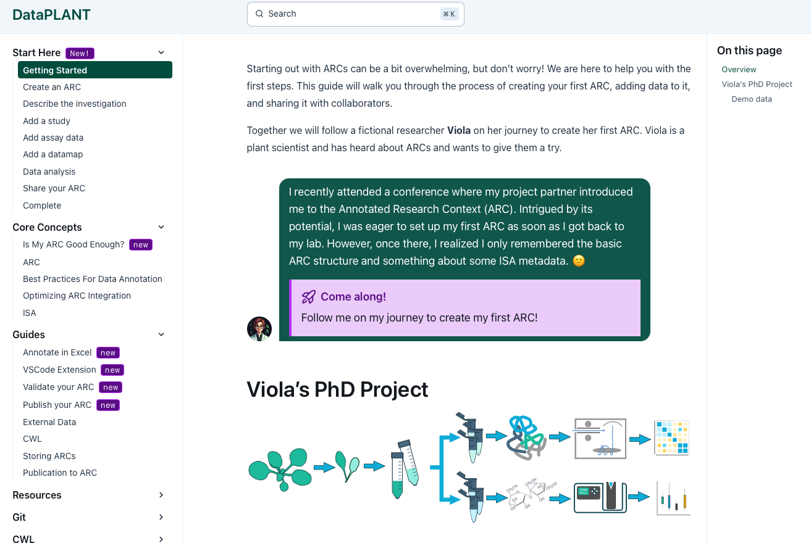
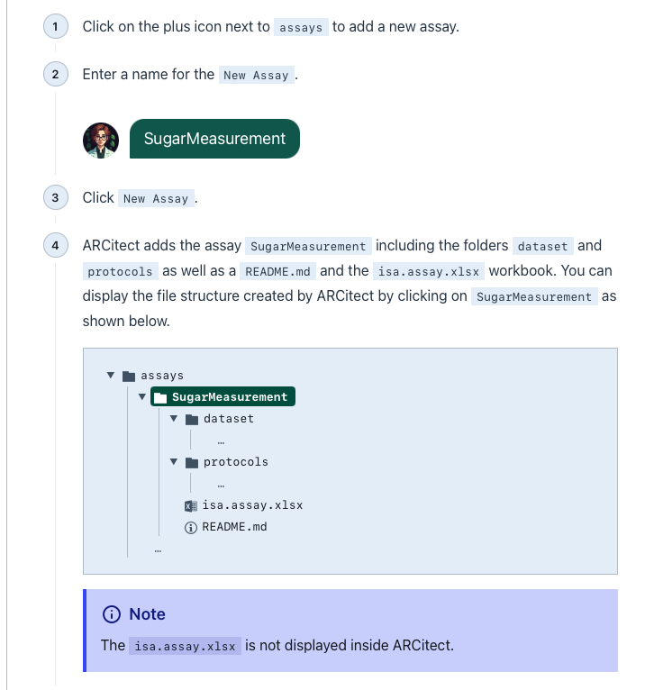

# The DataPLANT Knowledge Base

Contribution to DataPLANT

DataSteward Circle – December 11<sup>th</sup>, 2024

Dominik Brilhaus

---

# Goal of the Knowledge Base


- Articles about RDM topics, DataPLANT concepts
- Self-guided tutorials
- Addresses: primarily (non-technical) users

DataPLANT Knowledge Base: https://nfdi4plants.org/nfdi4plants.knowledgebase/

---

# Getting-Started guide <!-- fit -->

https://nfdi4plants.github.io/nfdi4plants.knowledgebase/start-here/



- ready-to-use for workshops
- includes demo material

---

## Please help improve the Knowledge Base

- Read and use the knowledge base content
- [Raise issues](https://github.com/nfdi4plants/nfdi4plants.knowledgebase/issues/new/choose)
- Open pull-requests
  - suggest changes
  - create or edit content

---

## Contribution guide

Details in the [contribution guide](https://github.com/nfdi4plants/nfdi4plants.knowledgebase/blob/main/CONTRIBUTING.md). 


---

## Framework

- Knowledge Base is built on [astro starlight](https://starlight.astro.build)
- Starlight itself builds on [astro](https://astro.build)

:bulb: Please also check their docs for features or installation instructions

---

## Installation

0. Sign up for a [GitHub](https://github.com) account
1. Install [Node JS](https://nodejs.org/)
2. Clone the Knowledge Base repo via `git clone https://github.com/nfdi4plants/nfdi4plants.knowledgebase`

---

## Create content and watch locally

1. Install (latest) package dependencies via `npm install`
2. Start the knowledge base in watch mode via `npm run dev`
3. Open the page in your browser http://localhost:4321/nfdi4plants.knowledgebase

---

## Check for dead links

You can test-build the site via `npm run build` to validate all links.

:bulb: Also tested on every **pull-request**

---

## Markdown

All articles are written in markdown (`.md` or `.mdx`).
See https://starlight.astro.build/guides/authoring-content/ for a short introduction.

---

## VSCode

We recommend working with [Visual Studio Code](https://code.visualstudio.com/) to generate content

Recommended VSCode extensions:

- Astro Build: https://marketplace.visualstudio.com/items?itemName=astro-build.astro-vscode
- MDX: https://marketplace.visualstudio.com/items?itemName=unifiedjs.vscode-mdx
- Other extensions, e.g. for
  - Markdown
  - GitHub

💡 The `.mdx` files cannot be previewed in VSCode. Please use `npm run dev` as described above.

---

## Sections – Where to place your content?

<style scoped>

.row {display: flex;}
.column {padding: 10px;}

</style>

<div class="row">
  
  <div class="column">


- **Start here**
  - Current best practice for ARC newcomers
  - Includes demo material

- **Guides**
  - specific topic or task
  - do not place specific tools documentation here

- **Core concepts**
  - DataPLANT and ARC core concepts

  </div>

  <div class="column">

  - `<specific-tool>`
    - tools to work with ARCs have their own section
    - e.g. ARCitect, ARC Commander, DataHUB

  - **Fundamentals**
    - Basic RDM topics
    - not necessary ARC-related, but "towards" ARC

  </div>
</div>

---

# Content metadata (yaml header)

<style scoped>

.row {display: flex;}
.column {padding: 10px;}

</style>

<div class="row">
  
  <div class="column" style="font-size: 22px; width:800px">

  - **MUST** start and end with `---`
  - **MUST** contain a `title: `
  - **MAY** contain ...
    - `lastUpdated: `
    - `authors: `
    - `draft: `
    - `pagefind: `
    - `sidebar: `
      - `order: `
      - `badge`
    - ...

  :bulb: Check the [Astro Starlight Docs](https://starlight.astro.build/reference/frontmatter/) for more options.

  </div>

  <div class="column" style="width:400px">

  ```yaml
  ---
  title: Metadata
  lastUpdated: 2024-12-11
  authors:
      - dominik-brilhaus
  draft: true
  pagefind: false
  sidebar:
      order: 2
      badge:
          text: new
          variant: tip
  ---
  ```

  </div>

</div>

---

## Authorship

Every author is listed via a file in [`src/content/authors`](src/content/authors). 

For example `src/content/authors/kevin-frey.yml`:

```yaml
name: Kevin Frey
image: "@images/authors/kevin-frey.jpg"
socials:
  - icon: simple-icons:github
    href: https://github.com/Freymaurer
  - icon: simple-icons:orcid
    href: https://orcid.org/0000-0002-8510-6810
affiliation: DataPLANT
```

The author easily be mentioned via yaml metadata

```yaml
authors:
  - kevin-frey
```

---

## Style Guide

- All files and folders must always be [kebap-case](https://developer.mozilla.org/en-US/docs/Glossary/Kebab_case).
- This means all lower case and `-` as word separator, e.g.

```md
src/assets/images/arc-commander/access-2.png
```

---

## Composition

- Always follow **DRY (Don't Repeat Yourself)** principle
- If you have the same content in multiple places, consider creating a reusable component, e.g. 
  - "How to register for DataPLANT"
  - "How to create an access token"
  - ...
- Use cross-references (links) to existing content
- In `.mdx` you can also directly insert other content in the current file

---

## Components


<style scoped>

.row {display: flex;}
.column {padding: 10px;}

</style>

<div class="row">
  
  <div class="column">

- **Components** help to style your content
- They are only available in `.mdx` files
- Starlight comes with [built-in components](https://starlight.astro.build/components/using-components/)
- Custom components are available in `src/components/mdx` directory

  </div>

  <div class="column">
  
  - Steps
  - Cards
  - Tabs
  - Mermaid
  - FileTree
  - ViolaSays
  - ...

  </div>
</div>a

---

## Component example

```mdx
    <Steps>

    1. Click on the plus icon next to `assays` to add a new assay.
    2. Enter a name for the `New Assay`.

        <ViolaSays>
            SugarMeasurement
        </ViolaSays>

    3. Click `New Assay`.
    4. ARCitect adds the assay `SugarMeasurement` including the folders
    `dataset` and `protocols` as well as a `README.md` and the
    `isa.assay.xlsx` workbook. You can display the file structure created
    by ARCitect by clicking on `SugarMeasurement` as shown below.
    
        <FileTree>
        - assays
            - **SugarMeasurement**
                - dataset
                    - ...
                - protocols
                    - ...
                - isa.assay.xlsx
                - README.md
            - ...
        </FileTree>

        :::note
        The `isa.assay.xlsx` is not displayed inside ARCitect.
        :::
    ...
```



---

## Images

- Try to use `.svg` files for icons, graphics and logos
- Use any other file format for screenshots or tutorial images
- Images should be stored in the `src/assets/images` directory. If your image has an obvious context, you SHOULD create a subdirectory for it.

```txt
src
|-- assets
    |-- images
        |-- arc-commander
            |-- access-1.png
            |-- access-2.png
            |-- access-3.png
```

---

## Adding images in `.md`/`.mdx`

In markdown you can use the following syntax:

```md

```

For html in `.mdx` you can use the following syntax:

```mdx
import MacOSSecurity from "@images/arcitect/macos-security.png"


```

---
---

## Training material

https://github.com/nfdi4plants/training-material

:bulb: Feel free to share your slide decks

--- 

# Acknowledgement

## :rocket: Kevin Frey! :rocket: