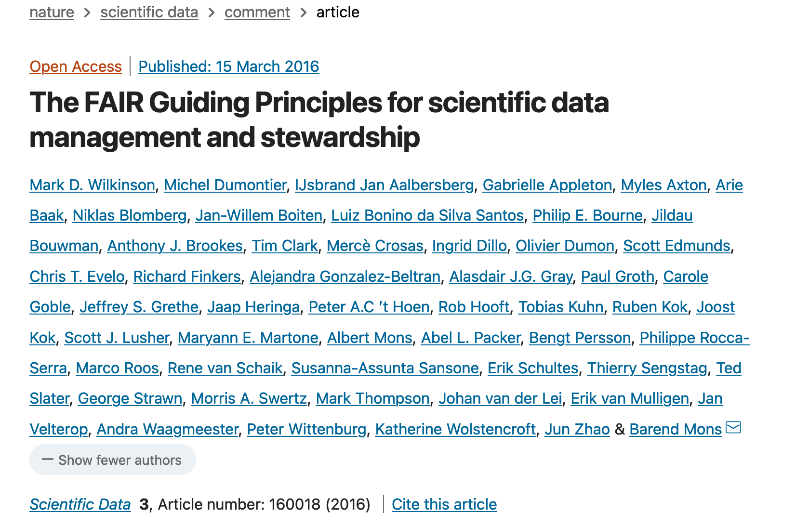
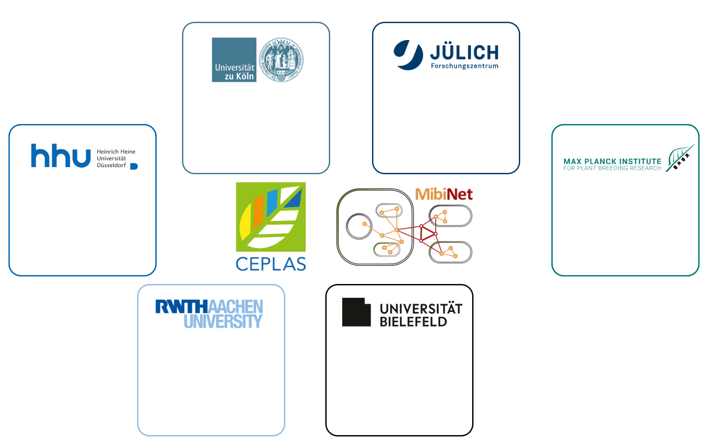
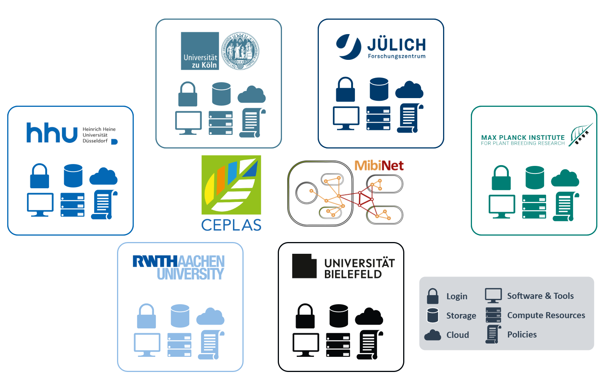
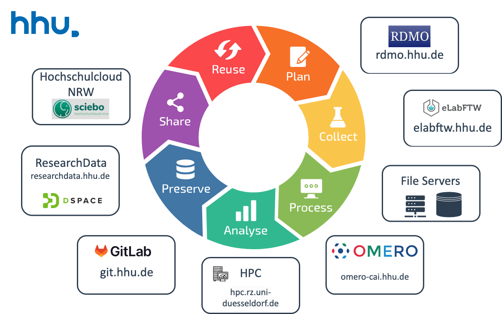
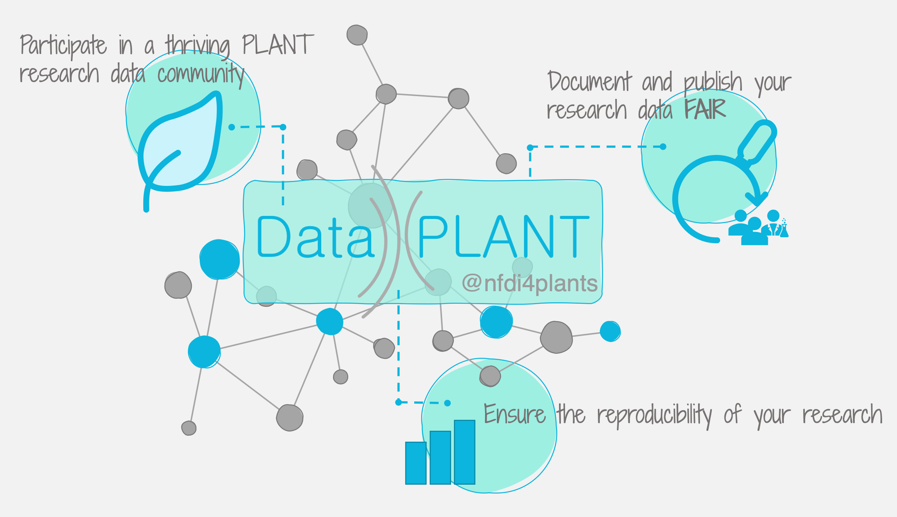
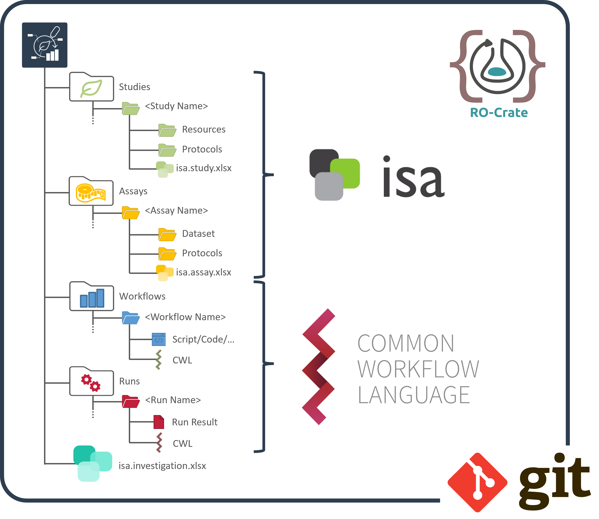
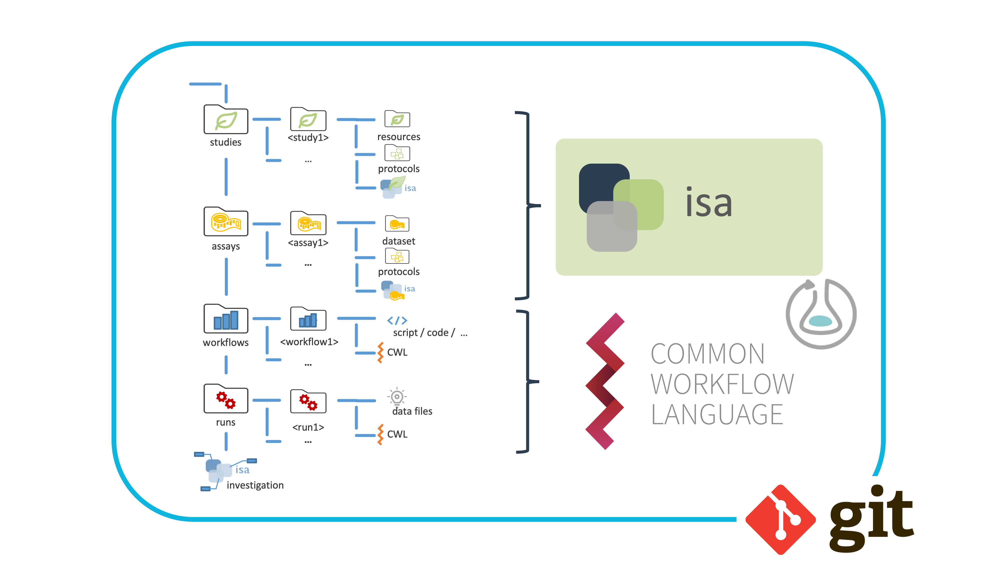
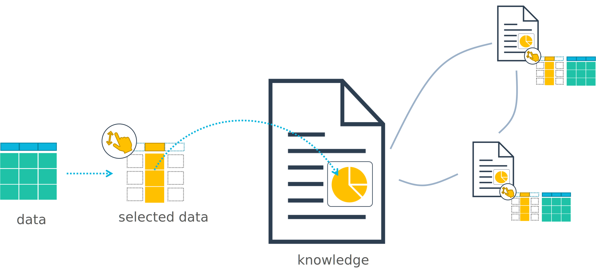
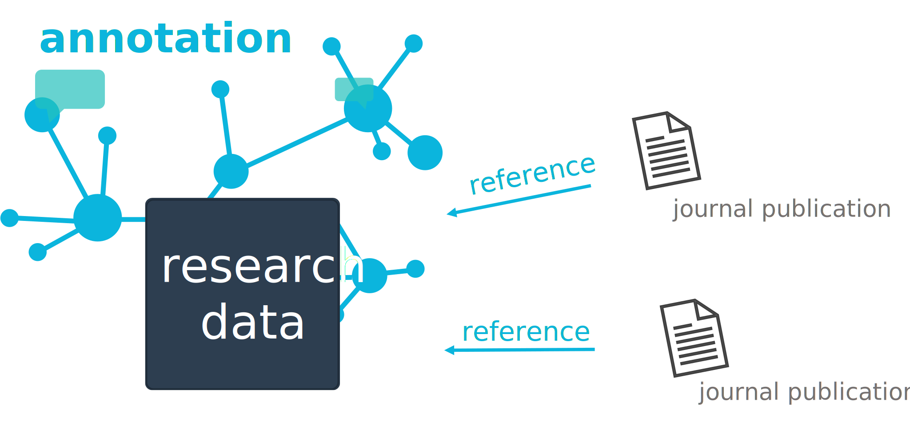

# ARCify your research project

<!--  _color: white; -->
<!-- _paginate: false -->

 

February 11th, 2025

Sabrina Zander, MibiNet
Dominik Brilhaus, CEPLAS

--- 

# Goals

- First few steps into ARC ecosystem
- Move existing datasets into ARCs
- Share them via the DataHUB
- Annotate with metadata

---

# House-keeping

  

  - Use the pad to raise questions and feedback
  - Copy / paste links (hands-on)

  

  

  
  

---

# Training Materials

Slides are shared via [DataPLANT Training Material](https://github.com/nfdi4plants/training-material/tree/main/slide-decks)

---

# Resources &ndash; join the open source movement

###  DataPLANT (nfdi4plants)

DataPLANT Website: <a href="https://nfdi4plants.org/" target="_blank">https://nfdi4plants.org/</a>
Knowledge Base: <a href="https://nfdi4plants.org/nfdi4plants.knowledgebase/" target="_blank">https://nfdi4plants.org/nfdi4plants.knowledgebase/</a>
DataHUB: <a href="https://git.nfdi4plants.org" target="_blank">https://git.nfdi4plants.org</a>

GitHub: <a href="https://github.com/nfdi4plants" target="_blank">https://github.com/nfdi4plants</a>
HelpDesk: <a href="https://helpdesk.nfdi4plants.org" target="_blank">https://helpdesk.nfdi4plants.org</a>

:bulb: You can help us by raising issues, bugs, ideas...

:rocket: NEW! ARC website: <a href="https://arc-rdm.org" target="_blank">https://arc-rdm.org</a>

---

# Continuous support

Data managers in Düsseldorf, Cologne, Jülich and close by (CEPLAS, MibiNet, TRR341) offer support.

- Join our [Slack](https://join.slack.com/t/arc-user-support/shared_invite/zt-2cadwq8cx-azPsJhUF8m0ukXsrstNc0A) or [Matrix](https://matrix.to/#/%23arc-user-support:matrix.org) for ad hoc support
- Monthly [user support meeting](https://nfdi4plants.github.io/events/arc-user-support/) (2nd Friday of the month)

  
  
  

---

# Introduce yourself

- Lab
- MibiNet / CEPLAS / TRR / ?
- Used code / programming language before
- Experience with Git / GitLab / GitHub?
- Have an ORCID
- My motivation / expectation
- My favorite lab assay

---

# Let's draw a typical lab workflow :pencil:

---

# FAIR data stewardship

- **F**indable
- **A**ccessible
- **I**nteroperable
- **R**eusable

https://doi.org/10.1038/sdata.2016.18

---

# The FAIR principles

---

# Is your data FAIR?

**F**indable | **A**ccessible | **I**nteroperable | **R**eusable

- Where do you store your data?
- How do you annotate your data?
- How do you share your data?
- What tools do you use to analyse your data?
- How do you reuse other people's data?

---

# CEPLAS & MibiNet &ndash; Scattered across six locations

---

# Data silos impede collaboration

---

# Missing interfaces impede collaboration

---

# NFDI – Nationale Forschungsdaten Infrastruktur

---

# NFDI – A community-targeted approach for RDM

---

# DataPLANT &ndash; *NFDI4plants*

- https://nfdi4plants.org
- https://arc-rdm.org

---

# Data Stewardship between DataPLANT and the community <!-- fit -->

---

# Annotated Research Context (ARC)

Your entire investigation in a single unified bag

---

# You can store your ARC in the DataHUB

---

# You can store your ARC in the DataHUB

---

# ARCs are versioned

---

# You can invite collaborators

---

# Collaborate and contribute

---

# Reuse data in ARCs

---
<!-- 
# Publish your ARC

---

# Publish your ARC, get a DOI

--- -->

# ARC as single-entry point

---

<!-- 

# Data analysis and workflows

 Weil, H.L., Schneider, K., et al. (2023), PLANTdataHUB: a collaborative platform for continuous FAIR data sharing in plant research. Plant J. https://doi.org/10.1111/tpj.16474 

--- 

# Galaxy integration: Extra value for plant research

- Full ARC compatibility
- Automated metadata generation
- Specialized tools and workflows for ‘omics processing and analysis
- Public repository compatibility
- Galaxy teaching resource for data analysis

--- -->

# Enabling platforms

  

  
  - Streamlined exchange of (meta)data
  - Communication and project management
  
  

  
  
  
  

---

# Streamlined data exchange

---

# Meet your collaborators in an ARC

---

# The ARC ecosystem

<!-- 

---

# What does an ARC look like?

---

# ARCs store experimental data

---

# Computations can be run inside ARCs

---

# ARCs come with comprehensive metadata

-->

--- 

# ARC builds on standards <!-- fit -->
  

### RO-Crate

- standardized exchange
- https://www.researchobject.org/ro-crate/ 

### ISA
 
 - structured, machine-readable metadata
 - https://isa-tools.org/

### CWL

- reproducible, re-usable data analysis 
- https://www.commonwl.org/

### Git

- version control
- https://git-scm.com

<!-- 

---

# Everything is a file

The ARC is a **data-centric** approach to RDM

---

# No technical lock-in

(Meta)data transparency with tool assistance but **no technical lock-in**

-->

---

## Hands-on part 1: Setup and ARCitect

---

## ARC: Annotated research context

---

## The ARC scaffold structure

---

## A small prototypic project

---

## Divide and conquer for reproducibility

---

## Identifying the ‘study’ part

---

## A table-based organization schema

---

## Referencing a protocol

This allows you to reference the free-text, human-readable protocol.

:bulb: It is recommended that the protocol is in an open format (.md|.txt|.docx|…)
:bulb: But everything is possible also an URI to an electronic lab notebook

---

## Parameterizing the ‘study’

---

## Finding the right metadata vocabulary

  

  
  ### Parameters []
  
  - Light intensity 200 µEinstein
  - Temperature 6°C / 25°C
  - Growing 4d
  
  
  
  

  
  ### Characteristics []
  
  - Arabidopsis thaliana
  - Leaf
  - Hydroponic culture
  - Columbia
  
  

---

## OLS: Finding the right metadata vocabulary

Ontology Lookup Sevice (OLS): https://www.ebi.ac.uk/ols4/

---

## Finding the metadata vocabulary and descriptors

---

## Finding the metadata vocabulary and descriptors

  

  
  ### Parameters []
  
  - 
    -  Light intensity 200 µEinstein
  -   
    -  Temperature 6°C / 25°C
  - 
    -  Growing 4d
  
  
  

  

  
  ### Characteristics []
  
  - 
    -  Arabidopsis thaliana
  - 
    -  Leaf
  - 
    -  Hydroponic culture
  - 
    -  Columbia
  
  

---

## Finding the metadata vocabulary and descriptors

  

  
  ### Parameters []
  
  -  Light intensity
    -  200 µEinstein
  -  Temperature  
    -  6°C / 25°C
  -  Growth time
    -  4d
  
  

  

  
  ### Characteristics []
  
  -  Organism
    -  Arabidopsis thaliana
  -  Tissue
    -  Leaf
  -  Growth medium
    -  Hydroponic culture
  -  Ecotype
    -  Columbia
  
  

---

## Hands-on part 1: Setup and ARCitect

Follow the [**Start Here** guide](https://nfdi4plants.github.io/nfdi4plants.knowledgebase/start-here/) in the DataPLANT knowledge base.

:pencil: Until step **Add a study**

---

## Hands-on part 2: ARCitect (and Swate)

---

## Identifying assays

---

## Assay for sugar measurement

---

## Separating different assay elements

---

## Isolating the lab processes in an assay

---

## Parameteterization: sugar extraction

-  Vortex Mixer
  -  3 seconds
-  Temperature  
  -  95 degree celsius

---

## Parameteterization: sugar measurement

-  technical replicate
  -  1,2,3,...
-  sample volume 
  -  10 `microliter`
-  buffer volume 
  -  190 `microliter`
-  cycle count
  -  5

---

## Save time using standard methods and SOPs

**Parameter []**

-  Protein Precipitation
  -  acetone
-  cleavage agent name 
  -  Trypsin
-  sample preparation
  -  reversed-phase solid-phase extraction
- ...

**Component []**

-  chromatography instrument model 
  -  nanoElute2
-  chromatography column model 
  -  PepSep C18 1.9u, 25cm x 75um
...

---

## Applying standard procedures to sample record

---

# Realization of lab-specific metadata with templates

Facilities can define their most common workflows as templates

---

## Hands-on part 2: ARCitect (and Swate)

Continue the [**Start Here** guide](https://nfdi4plants.github.io/nfdi4plants.knowledgebase/start-here/) in the DataPLANT knowledge base.

:pencil: Until step **Add assay data**

---

## Hands-on part 3: Data

---

## Options to annotate the data analysis

---

## A computational workflow is like a protocol

---

## Option I: Create a virtual assay

---

## Option II: Create a workflow and run

---

## Use CWL to wrap your workflow

---

## Hands-on part 3: Data

Continue the [**Start Here** guide](https://nfdi4plants.github.io/nfdi4plants.knowledgebase/start-here/) in the DataPLANT knowledge base.

:pencil: Until step **Data analysis**

---

# Hands-on part 4: DataHUB

---

# DataHUB overview

---

# ARC builds on standards + Git

---

# The DataPLANT DataHUB &ndash; a GitLab ***Plus***

---

# On-premise DataHUBs

ARC services are available as on-premise option

---

## Using the DataHUB to collaborate

---

# The Research Data Lifecycle ***is mutable***

---

# **Mutable** data life cycle

 Weil, H.L., Schneider, K., et al. (2023), PLANTdataHUB: a collaborative platform for continuous FAIR data sharing in plant research. Plant J. https://doi.org/10.1111/tpj.16474 

---

## Project management

 Weil, H.L., Schneider, K., et al. (2023), PLANTdataHUB: a collaborative platform for continuous FAIR data sharing in plant research. Plant J. https://doi.org/10.1111/tpj.16474 

---

## ARCs come with their own wiki space

- directly associated to your ARC
- same access rights as your ARC
- share meeting minutes or ideas with collaboration partners
- keep ARC clean of files that are not considered "research data"

---

## Hands-on part 4: DataHUB

Continue the [**Start Here** guide](https://nfdi4plants.github.io/nfdi4plants.knowledgebase/start-here/) in the DataPLANT knowledge base.

:pencil: Until the final **complete** step

---

# DataHUB terminology and data sharing

---

## Choosing the proper role

When inviting new members to an ARC or group, you can choose between different levels.

:bulb: By default you are **Owner** of an ARC you create or upload to the DataHUB.

---

## **Projects** and **Groups** are not the same

- "Project" = ARC
- "Groups" = Group of users

---

## Project = ARC

- In the DataHUB, ARCs are called "projects"; they are the same.
- An ARC can be shared with individual users (invited as "members") or a group.

---

## DataHUB Groups = Group of members (e.g. lab)

- A "Group" is a group of users with specific [permissions](#roles-and-permissions)
- A group can share ARCs
- A group can be invited to an ARC
- Groups can have subgroups

---

## Options to share an ARC via the DataHUB

---

## Namespaces

- Every user has a personal namespace, where they can upload or create new ARCs
- Every group and subgroup has its own namespace

Type | URL | Namespace | Name
--- | --- | --- | --- 
A **personal** ARC | https://git.nfdi4plants.org/brilator/Facultative-CAM-in-Talinum | `brilator` | Dominik Brilhaus
An **group**-shared ARC | https://git.nfdi4plants.org/hhu-plant-biochemistry/Samuilov-2018-BOU-PSP | `hhu-plant-biochemistry` | HHU Plant Biochemistry

### :bulb: **Personal** is not the same as **private**

---

## Visibility

The visibility of ARCs and groups can be managed individually for each ARC or group
  

:bulb: By default every ARC and every group is set to **private**.

---

## ARC DataHUB members // ARC Investigation contacts <!-- fit -->

:bulb: Investigation contacts are not automatically invited as members to the ARC.

---

## Version control

Check out the **commit history** of your ARC via Repository (2) or directly via commits (7)

---

# Hands-on part 5: ARC data publication

---

# Moving from paper to FAIR data publication

---

# Moving from paper to data publications

---

# Publish your ARC, get a DOI

---

# Publish your ARC with a few clicks

---

# Validation

 adapted from Weil, H.L., Schneider, K., et al. (2023), PLANTdataHUB: a collaborative platform for continuous FAIR data sharing in plant research. Plant J. https://doi.org/10.1111/tpj.16474 

---

# Validate & publish

 Weil, H.L., Schneider, K., et al. (2023), PLANTdataHUB: a collaborative platform for continuous FAIR data sharing in plant research. Plant J. https://doi.org/10.1111/tpj.16474 

---

## Validation towards publication

---

## Receive a DOI

---

## Hands-on part 5: Data publication

1. [ARC validation](https://nfdi4plants.github.io/nfdi4plants.knowledgebase/guides/validate-arc/)
2. (Towards) [ARC publication](https://nfdi4plants.github.io/nfdi4plants.knowledgebase/guides/publish-arc/)

---

# Q&A and Wrap-up

---

# DataPLANT Resources &ndash; join the open source movement <!-- fit -->

DataPLANT Website: <a href="https://nfdi4plants.org/" target="_blank">https://nfdi4plants.org/</a>
Knowledge Base: <a href="https://nfdi4plants.org/nfdi4plants.knowledgebase/" target="_blank">https://nfdi4plants.org/nfdi4plants.knowledgebase/</a>
DataHUB: <a href="https://git.nfdi4plants.org" target="_blank">https://git.nfdi4plants.org</a>

GitHub: <a href="https://github.com/nfdi4plants" target="_blank">https://github.com/nfdi4plants</a>
HelpDesk: <a href="https://helpdesk.nfdi4plants.org" target="_blank">https://helpdesk.nfdi4plants.org</a>

:bulb: You can help us by raising issues, bugs, ideas...

:rocket: NEW! ARC website: <a href="https://arc-rdm.org" target="_blank">https://arc-rdm.org</a>

---

# Continuous support

Data managers in Düsseldorf, Cologne, Jülich and close by (CEPLAS, MibiNet, TRR341) offer support.

1. Slack Workspace for ad hoc support
2. Monthly user meeting (2nd Friday of the month)

[&rarr; Details](https://www.ceplas.eu/en/research/data-science-and-data-management).

  
  
  

---

# Five-Finger-Feedback

<!-- 
- Invite participants to give feedback
- If feasible, collect transparently on a board or in a markdown pad, etc. 

# Five-Finger-Feedback

...was too short | I'm happy with... | I did not like at all ...| This idea or advice was good: ... | I really liked ...  
---|---|---|---|---
... | ... | ... | ... | ...

-->

---

# Contributors

If not referenced otherwise, figures and slides presented here were created by members of DataPLANT (https://nfdi4plants.org).
Additional slides were contributed by

- name: Dominik Brilhaus
  github: https://github.com/brilator
  orcid: https://orcid.org/0000-0001-9021-3197
- name: Kevin Frey
  github: https://github.com/Freymaurer
  orcid: https://orcid.org/0000-0002-8493-1077
- name: Sabrina Zander
  orcid: https://orcid.org/0009-0000-4569-6126

---
