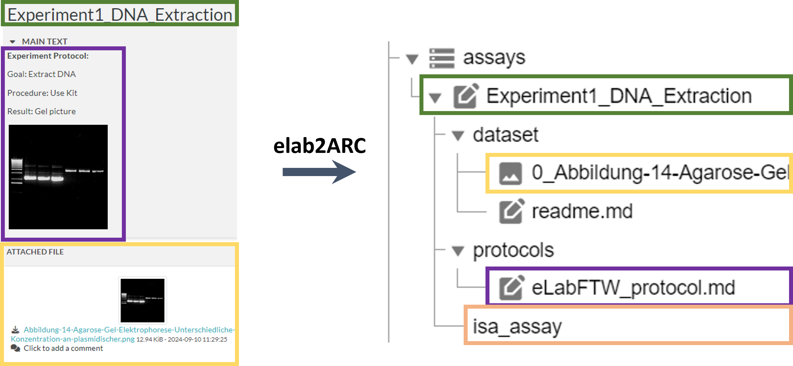

# elab2ARC Documentation

https://nfdi4plants.github.io/nfdi4plants.knowledgebase/resources/elab2arc/

---

# Working Scenario

### 1. Use ARCs to
- Organize and store (raw) data locally
- Share and communicate data with collaboration partners
- Annotate and prepare data for publication

### 2. Use elabFTW to
- Document daily lab work „on the fly“
- Organize lab routines with colleagues

---
# eLabFTW & ARC Connection

### Aim
- Reducing duplication/ additional workload
- Transformation of data from elabFTW into ARC
- User-friendly, easy implementation 

### Challanges
- ELNs are unstructed; automated translation and interoperation into well-structured ARC challenging 

### Solution
- Start with automated transition of data without 
    - metadata mapping, 
    - structured metadata extraction,
    - re-structuring of elabFTW content

---
# Conversion 

---

# Conversion 
The elab2ARC tool will automatically convert your elabFTW experiments into ARC format
- create a new assay folder with eLabFTW experiment name as assay name 
- create the assay folder structure (dataset/protocols/isa.assay)
- convert experiment main text into a .md file and store it in the protocol folder 
- add all attachments of the eLabFTW experiment into the dataset folder 
- enter name/email/affiliation of the eLabFTW experiment metadata into the isa.assay sheet

---

# elab2ARC Tool

Tool: https://nfdi4plants.github.io/elab2arc/ 

Documentation: https://nfdi4plants.github.io/nfdi4plants.knowledgebase/resources/elab2arc/

Issues/Problems:
https://github.com/nfdi4plants/elab2arc
